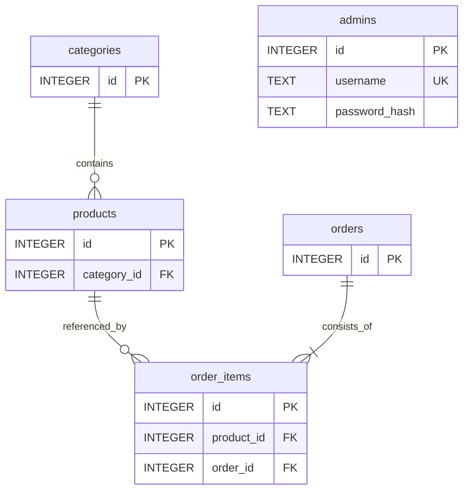

# Схема SQLite

Джерело схеми: `coffeeflow/schema.sql`, версія `PRAGMA user_version = 1`. Кодування тексту — Unicode, гроші — цілі копійки UAH, час — ISO 8601 UTC.

| Таблиця | Поля | Призначення |
|---|---|---|
| categories | id PK, name UNIQUE | Категорії меню |
| products | id PK, category_id FK, name, description, price_cents, image_url, is_available, is_deleted | Каталог і м’яке видалення |
| admins | id PK, username UNIQUE, password_hash | Облікові записи працівників |
| orders | id PK, owner_hash, customer_name, phone, pickup_at, comment, total_cents, status, created_at | Замовлення та зв’язок із гостьовою сесією |
| order_items | id PK, order_id FK, product_id FK, product_name, unit_price_cents, quantity | Склад і незмінні знімки назви та ціни |

Користувачі не реєструються. Контактні дані зберігаються в конкретному замовленні; окремої таблиці клієнтів немає. SHA-256 від випадкового ідентифікатора гостьової сесії зберігається в `owner_hash`, але не повертається в API.

`PRAGMA foreign_keys=ON` вмикається для кожного з’єднання. Для позицій діє унікальність `(order_id, product_id)`, для кількості — 1–20, для ціни товару — 1–10000000 копійок. API перевіряє відповідні межі до запису. Замовлення з позиціями записується в `BEGIN IMMEDIATE` / COMMIT; при будь-якій помилці — ROLLBACK. Вимога принаймні однієї позиції забезпечується сервісом замовлень у транзакції.

Категорія з товарами не видаляється. DELETE товару встановлює `is_deleted=1`, `is_available=0`, тому позиції минулих замовлень залишаються пов’язаними з товаром. Зміна ціни чи назви в каталозі не змінює історичний знімок позиції. API не підтримує видалення замовлень.

Індекси створено для категорії товару та `(status,id)` замовлення. На запит відкривається з’єднання, яке закривається після завершення контексту Flask. Час очікування блокування — 5 секунд; помилка доступності бази повертається як 503 без SQL чи внутрішніх шляхів.

`init-db` створює лише відсутні таблиці, не є універсальним засобом міграції й не видаляє наявні записи. При наступній зміні схеми потрібна окрема міграція та резервна копія.
